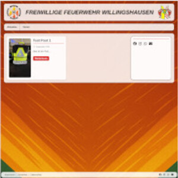

# Feuerwehr Willingshausen



Custom [Grav](https://getgrav.org) Theme für die Freiwillige Feuerwehr Willingshausen.

# Installation

Installing the Feuerwehr theme can be done in one of two ways. Our GPM (Grav Package Manager) installation method enables you to quickly and easily install the theme with a simple terminal command, while the manual method enables you to do so via a zip file.

## GPM Installation (Preferred)

The simplest way to install this theme is via the [Grav Package Manager (GPM)](https://learn.getgrav.org/advanced/grav-gpm) through your system's Terminal (also called the command line). From the root of your Grav install type:

```
bin/gpm install feuerwehr
```

This will install the Feuerwehr theme into your `/user/themes` directory within Grav. Its files can be found under `/your/site/grav/user/themes/feuerwehr`.

> Note: GPM installation is only available after the theme has been published to the Grav repository.

## Manual Installation

To install this theme, just download the zip version of this repository and unzip it under `/your/site/grav/user/themes`. Then, rename the folder to `feuerwehr`. You can find these files on [GitHub](https://github.com/TimUx/grav-theme-feuerwehr).

You should now have all the theme files under

```
/your/site/grav/user/themes/feuerwehr
```

> NOTE: This theme is a modular component for Grav which requires [Grav](https://github.com/getgrav/grav) `>= 1.7.0`.

### Fonts & Attribution

* **Oswald** – SIL Open Font License 1.1 (see `fonts/OFL-Oswald.txt`)
* **Font Awesome 6** (Subset) – lokal unter `fonts/fontawesome/` / `css/fontawesome-subset.css`; [Font Awesome Free License](https://fontawesome.com/license/free)

# Updating

## Manual Update

Manually updating Feuerwehr is pretty simple. Here is what you will need to do to get this done:

* Delete the `your/site/user/themes/feuerwehr` directory.
* Download the new version of the Feuerwehr theme from [GitHub](https://github.com/TimUx/grav-theme-feuerwehr).
* Unzip the zip file in `your/site/user/themes` and rename the resulting folder to `feuerwehr`.
* Clear the Grav cache. The simplest way to do this is by going to the root Grav directory in terminal and typing `bin/grav clear-cache`.

> Note: Any changes you have made to any of the files listed under this directory will also be removed and replaced by the new set. Any files located elsewhere (for example a YAML settings file placed in `user/config/themes`) will remain intact.

## Features

* Theme für Feuerwehr-Websites (FFW Willingshausen)
* Responsive Layout mit Burger-Navigation
* Blog-Ansicht mit Pagination-Unterstützung
* Einsatzbericht-Template mit strukturierten Feldern
* Zweispalten-Seitenlayout (benötigt Shortcode Core)
* Sidebar mit Suche und Social-Links (Facebook, Instagram, WhatsApp, E-Mail)
* Lokale Oswald-Schriftart sowie lokales Font-Awesome-Subset (nur genutzte Icons)
* Fehlerseite (`error`) im Theme-Look
* Optionaler Demo-Inhalt unter `_demo/`

### Empfohlene Plugins

* [SimpleSearch](https://github.com/getgrav/grav-plugin-simplesearch) – Suche in Sidebar/Navigation
* [Pagination](https://github.com/getgrav/grav-plugin-pagination) – Blog-Seiten
* [Archives](https://github.com/getgrav/grav-plugin-archives) – Archiv in der Sidebar
* [PhotoSwipe](https://github.com/getgrav/grav-plugin-photoswipe) – Bildergalerien
* [Shortcode Core](https://github.com/getgrav/grav-plugin-shortcode-core) – Zweispalten-Layout (`page2c`)
* Likes-Plugin (falls verwendet) – Like-Button auf Posts/Einsatzberichten

### Supported Page Templates

* Default view template
* Blog view template
* Post / Blog item view template
* Form view template
* Page (single column) view template
* Page2c (two column) view template
* Einsatzbericht view template
* Error view template
* SimpleSearch results view template

# Configuration

Default configuration shipped with the theme (`feuerwehr.yaml`):

```yaml
enabled: true
posts:
  read_more_label: 'Weiterlesen'
sidebar:
  show_search: true
  show_social: true
social:
  facebook: 'https://www.facebook.com/ffw.willingshausen'
  instagram: 'https://www.instagram.com/ffw.willingshausen'
  whatsapp: 'https://whatsapp.com/channel/...'
  email: 'email@feuerwehr-willingshausen.de'
```

To customize these options, copy `feuerwehr.yaml` to your `user/config/themes/` folder and edit there. You can also configure the theme via the Administration Panel.

# Performance (Site/Server)

Empfohlene Grav-Einstellungen in `user/config/system.yaml` (nicht Teil des Themes):

```yaml
twig:
  cache: true
  auto_reload_templates: false   # in Produktion
assets:
  css_pipeline: true
  css_minify: true
  js_pipeline: true
  js_minify: true
images:
  cache: true
```

Zusätzlich am Webserver Gzip/Brotli und Cache-Header für `user/themes/feuerwehr/`-Assets aktivieren.

# Setup

If you want to set Feuerwehr as the default theme, you can do so by following these steps:

* Navigate to `/your/site/grav/user/config`.
* Open the **system.yaml** file.
* Change the `theme:` setting to `theme: feuerwehr`.
* Save your changes.
* Clear the Grav cache. The simplest way to do this is by going to the root Grav directory in Terminal and typing `bin/grav clear-cache`.

Once this is done, you should be able to see the new theme on the frontend.
